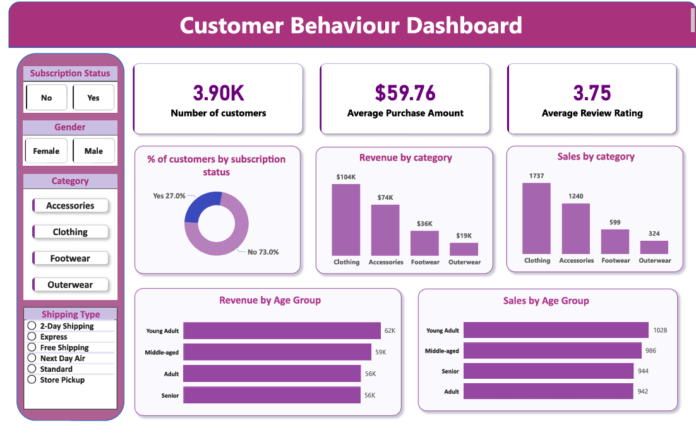

# 🛍️ Customer Shopping Behaviour Analysis

> An end-to-end data analytics project that analyzes customer shopping behaviour using **Python**, **MySQL**, and **Power BI** to uncover purchasing patterns, customer segments, and actionable business insights.

---

## 📌 Project Overview

Customer behaviour analysis plays a crucial role in helping businesses understand purchasing patterns and improve decision-making.

In this project, I analyzed a retail customer shopping dataset to identify trends in customer spending, product preferences, subscription behaviour, seasonal demand, shipping choices, and payment methods.

The project demonstrates the complete data analytics lifecycle—from data cleaning to database analysis and interactive dashboard creation.

---

## 🎯 Business Problem

A retail company wants to answer questions such as:

- Which products generate the highest sales?
- Do subscribed customers spend more than non-subscribers?
- Which shipping methods are preferred by customers?
- How do discounts influence purchasing behaviour?
- Which customer segments contribute the most revenue?
- What seasonal trends can help optimize inventory and marketing?

The objective is to transform raw customer data into actionable insights that support business growth.

---

# 🛠️ Tech Stack

| Tool | Purpose |
|------|---------|
| 🐍 Python | Data Cleaning & Preparation |
| 🐼 Pandas | Data Manipulation |
| 🗄️ MySQL | Database & SQL Analysis |
| 📊 Power BI | Dashboard & Visualization |
| 📒 Jupyter Notebook | Data Analysis |
| 🌳 Git & GitHub | Version Control |

---

# 📂 Project Workflow

```text
CSV Dataset
      │
      ▼
Python (Cleaning & Transformation)
      │
      ▼
MySQL Database
      │
      ▼
SQL Business Analysis
      │
      ▼
Power BI Dashboard
      │
      ▼
Business Insights & Recommendations
```

---

# 📁 Project Structure

```
Customer-Shopping-Behaviour-Analysis
│
├── 📂 data
│     └── customer_shopping_data.csv
│
├── 📂 notebooks
│     └── Customer_Shopping_Behaviour_Analysis.ipynb
│
├── 📂 sql
│     └── customer_analysis.sql
│
├── 📂 dashboard
│     └── Customer_Shopping_Dashboard.pbix
│
├── 📂 images
│     └── dashboard.png
│
├── README.md
└── requirements.txt
```

---

# 🔍 Data Preparation (Python)

✔ Imported customer shopping dataset

✔ Cleaned missing values

✔ Removed duplicate records

✔ Checked data types

✔ Performed exploratory data analysis (EDA)

✔ Exported cleaned data into MySQL

---

# 🗄️ SQL Analysis

Performed business-driven SQL analysis to answer real-world questions such as:

- Revenue generated by each product category
- Average customer spending
- Customer segmentation
- Subscription vs Non-subscription behaviour
- Shipping preference analysis
- Seasonal purchasing trends
- Discount effectiveness
- Most purchased products
- Payment method analysis
- Customer loyalty analysis

---

# 📊 Power BI Dashboard

The interactive dashboard provides insights through:

- 📌 KPI Cards
- 💰 Revenue Analysis
- 👥 Customer Segmentation
- 🛍️ Product Category Performance
- 🚚 Shipping Analysis
- 💳 Payment Method Analysis
- ⭐ Subscription Insights
- 🌤️ Seasonal Sales Trends
- 🎛️ Interactive Filters & Slicers

---

# 📈 Key Insights

- Subscribers generated higher average revenue than non-subscribers.
- Clothing and Electronics were among the highest-performing categories.
- Discount campaigns positively influenced purchase behaviour for several products.
- Standard Shipping remained the most preferred shipping option.
- Loyal customers contributed significantly to total revenue.
- Seasonal shopping trends highlighted opportunities for targeted marketing campaigns.

---

# 💡 Skills Demonstrated

### Programming

- Python
- SQL

### Data Analytics

- Data Cleaning
- Data Wrangling
- Exploratory Data Analysis
- Business Analysis
- Customer Segmentation

### Database

- MySQL
- SQL Queries
- Aggregate Functions
- Window Functions
- CTEs
- CASE Statements
- Joins

### Visualization

- Power BI
- Interactive Dashboards
- KPI Reporting
- Data Storytelling

### Version Control

- Git
- GitHub

---

# 📷 Dashboard Preview

```markdown

```

---

# 🤝 Contributing

Contributions, suggestions, and improvements are always welcome.

Feel free to fork this repository and submit a pull request.

---

# 📬 Contact

Akanksha Kumari
💼 LinkedIn: https://linkedin.com/in/akanksha-kumari-1a0222289

🌐 GitHub: https://github.com/Akanksha265

---

## ⭐ If you found this project useful, consider giving it a star!
